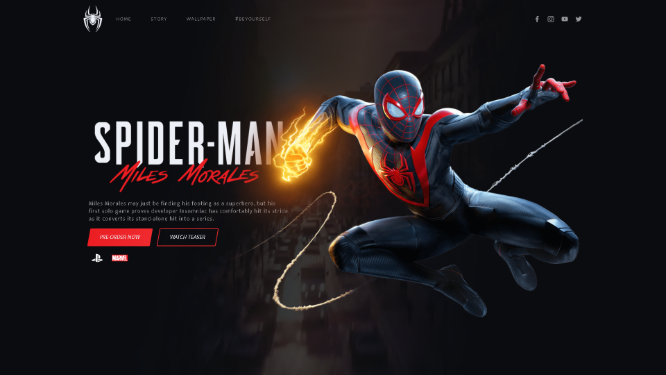
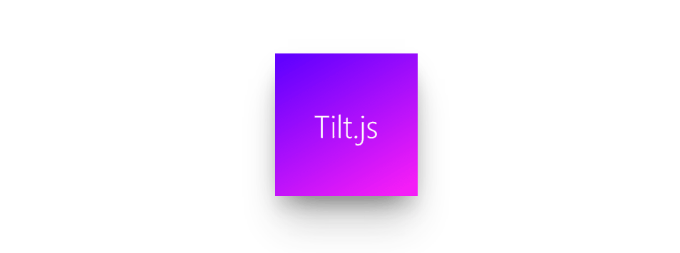

 
# web application using libraries GSAP and TILT
# animations and responsibility

<div align ="center">
 <h1>🚀effect Spider-man</h1>
 </div>


 

```bash

# GSAP CDN TWEEN animation works version 2.x
https://cdnjs.cloudflare.com/ajax/libs/gsap/2.1.2/TweenMax.min.js

#parallax tilt effect for jQuery over spider-man.

$('.js-tilt').tilt({
    glare: true,
    maxGlare: .5 
})

 
